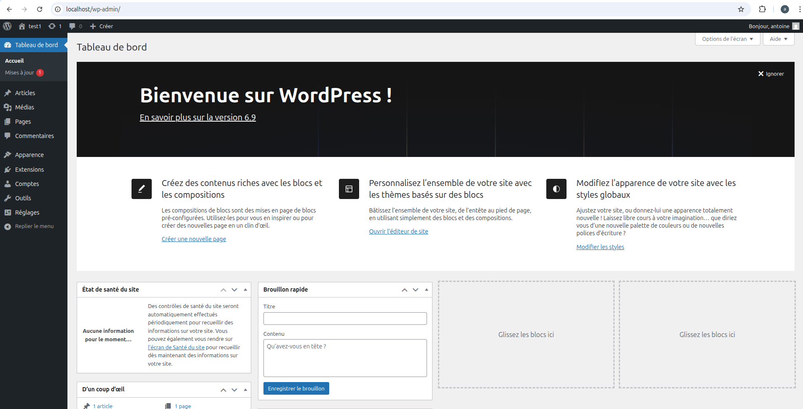

# WordPress-Stage-EPFL

# Partie 1

## Qu'est-ce que c'est wordpress ?

WordPress est un CMS donc un outil pour facilité grandement la création de site web.
Il permet notament de créer un site de A à Z sans écrire une ligne de code (no code).
Celui-ci est fait en PHP.

## WordPress est-il beaucoup utilisé ?

Oui c'est le CMS le plus utilisé dans le monde du web, de plus WordPress represente plus de 40% du web.
Donc Oui on peut dire que WordPress est beaucoup utilisé.

## Combien coûte WordPress ?

WordPress est gratuit et OpenSource, tout le monde peut l'utiliser et peut modifier le code source.

## Quelle est la différence entre wordpress.org et wordpress.com ?

[wordpress.org](https://wordpress.org) est le site principale de wordpress et contient notament la documentation, des tutos, ...

[wordpress.com](https://wordpress.com) comme son url l'indique (.com)
c'est le site pour la partie commercial de wordpress, donc on va retrouver une partie hebergement, une partie gestion du site un peu plus poussée pour les plus grosses entreprises. en plus de cela il va y avoir une partie de support pour aider la gestion du site.

## Je sais ce que c'est un CMS

Comme je l'ai dit plutôt un CMS aide à la création de site web sans avoir à écrire une ligne de code.
Donc avec que des interfaces de création de pages (drag n drop).

# Partie 2 (installation local)

## De quoi wordpress a besoin pour fonctionner ?

- PHP
- base de donnée (mysql/mariadb)
- apache2 (serveur web)

## installation des dépendances

PHP :

```sh
sudo apt install -y php
```

mysqli pour php :

```sh
sudo apt install -y php-mysql
```

apache 2 :

```sh
sudo apt install -y apache2
```

et pour mysql j'ai choisi de faire avec docker pour simplifier la tache, donc il faut avoir docker d'installer sur votre machine,
créer ce fichier `docker-compose.yml`

```yml
services:
  mysql:
    image: mysql:latest
    container_name: mariadb-container
    environment:
      MYSQL_ROOT_PASSWORD: votre-root-pw
      MYSQL_DATABASE: votre-db
      MYSQL_USER: votre-user
      MYSQL_PASSWORD: votre-pw
    ports:
      - "3306:3306"
    volumes:
      - mysql_data:/var/lib/mysql
    restart: always

volumes:
  mysql_data:
```

et lancer cette commande là où se trouve votre fichier compose :

```sh
docker compose up -d
```

## installation de wordpress

Donc pour installer wordpress on va en premier créer un dossier où on va mettre wordpress avec cette commande :

```sh
sudo mkdir -p  /srv/www
```

on change le proprietaire de ce dossier pour qu'apache puisse lire et écrire dedans :

```sh
sudo chown www-data: /srv/www
```

et enfin installer wordpress et décompresser dans le dossier qu'on a créer

```sh
curl https://wordpress.org/latest.tar.gz | sudo -u www-data tar zx -C /srv/www
```

## configuration de apache pour wordpress

Donc en premier on va créer un fichier de configuration de apache avec cette commande :

```sh
sudo vim /etc/apache2/sites-available/wordpress.conf
```

et mettre ce contenu :

```apacheconf
<VirtualHost *:80>
    DocumentRoot /srv/www/wordpress
    <Directory /srv/www/wordpress>
        Options FollowSymLinks
        AllowOverride Limit Options FileInfo
        DirectoryIndex index.php
        Require all granted
    </Directory>
    <Directory /srv/www/wordpress/wp-content>
        Options FollowSymLinks
        Require all granted
    </Directory>
</VirtualHost>
```

activer le site avec cette commande :

```sh
sudo a2ensite wordpress
```

activer la réécriture de l'url

```sh
sudo a2enmod rewrite
```

désactiver le it works par default

```sh
sudo a2dissite 000-default
```

et finalement recharger apache

```sh
sudo service apache2 reload
```

## configuration de la db

Donc si vous avez bien completer le docker-compose.yml (nom de db, user et pw)
alors il n'y a rien a faire ici.
Sinon refaite la partie création du container de la db et remplacer bien dans le fichier les credentials.$
sudo -u www-data cp /srv/www/wordpress/wp-config-sample.php /srv/www/wordpress/wp-config.php

## configuration de wordpress pour la db

Premièrement il faut créer le fichier de configuration avec comme base un fichier d'exemple (wp-config-sample.php) :

```sh
sudo -u www-data cp /srv/www/wordpress/wp-config-sample.php /srv/www/wordpress/wp-config.php
```

Deuxièmement modifier ce fichier avec ces commandes (il faut bien mettre vos credentials aux bons endroits donc bien quand c'est écrit <comme-ça>):

```sh
sudo -u www-data sed -i 's/database_name_here/<your-db>/' /srv/www/wordpress/wp-config.php
sudo -u www-data sed -i 's/username_here/<your-user>/' /srv/www/wordpress/wp-config.php
sudo -u www-data sed -i 's/password_here/<your-password>/' /srv/www/wordpress/wp-config.php
```

et finalement il faut aller changer quelques petites choses dans ce dossier pour la sécurité

```sh
sudo -u www-data vim /srv/www/wordpress/wp-config.php
```

et changer les données qu'il y a dans ces valeurs :

```php
define( 'AUTH_KEY',         'put your unique phrase here' );
define( 'SECURE_AUTH_KEY',  'put your unique phrase here' );
define( 'LOGGED_IN_KEY',    'put your unique phrase here' );
define( 'NONCE_KEY',        'put your unique phrase here' );
define( 'AUTH_SALT',        'put your unique phrase here' );
define( 'SECURE_AUTH_SALT', 'put your unique phrase here' );
define( 'LOGGED_IN_SALT',   'put your unique phrase here' );
define( 'NONCE_SALT',       'put your unique phrase here' );
```

Et normalement vous pouvez créer votre site si vous aller sur [localhost](http://localhost)



## Problème rencontré

j'ai eu un seul probleme c'était le host de la db dans le wp-config.php qui était par defaut localhost,
mais je ne sais pas pourquoi cela ne fonctionnait pas alors j'ai remplacer par 127.0.0.1 ce qui a résolu le problème.
